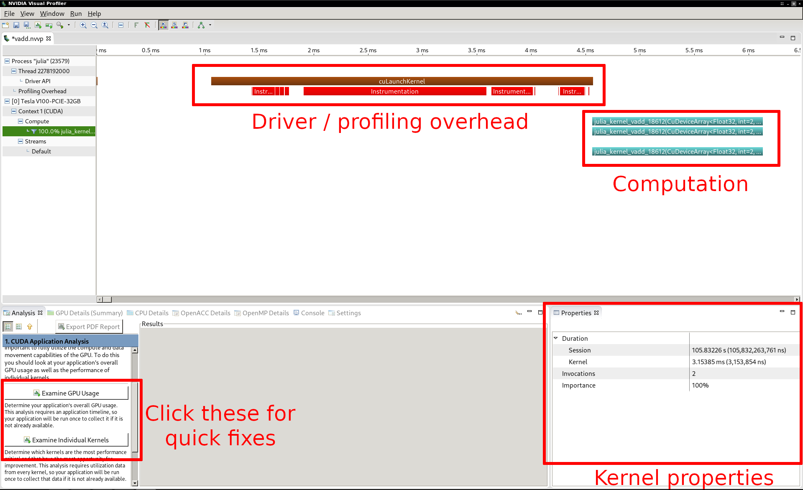
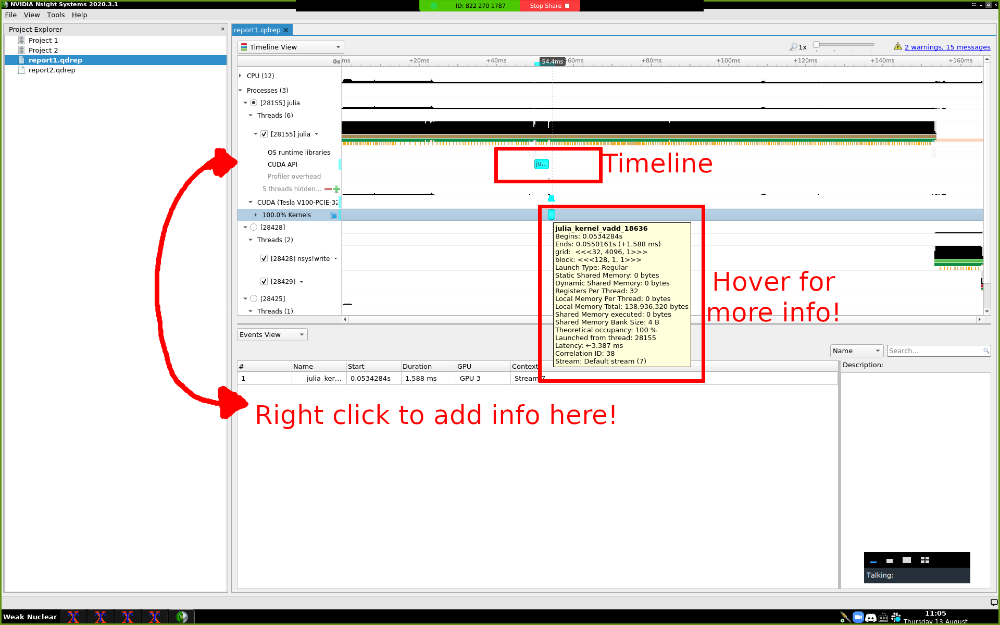
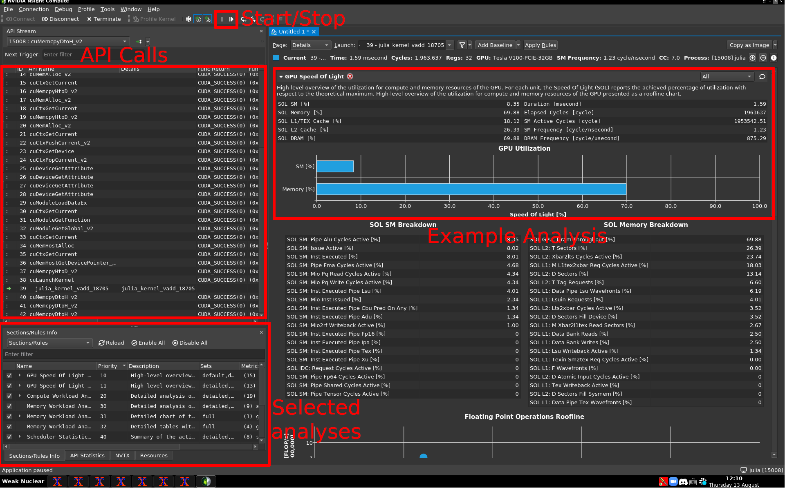

# Performance Tests
Getting decent performance metrics from GPU code can be a chore, so we'll try to explain it here.
For more information, please consult: https://juliagpu.gitlab.io/CUDA.jl/development/profiling/.
For this example, we will be creating a CUDA.jl example and running it in both nvvp and Nsight. First, let's create a basic vector addition example...

```
using CUDA, Test

function kernel_vadd(a, b, c)
    i = (blockIdx().x-1) * blockDim().x + threadIdx().x
    j = (blockIdx().y-1) * blockDim().y + threadIdx().y
    c[i,j] = a[i,j] + b[i,j]
    return nothing
end

res = 1024

# CUDAdrv functionality: generate and upload data
a = round.(rand(Float32, (res, res)) * 100)
b = round.(rand(Float32, (res, res)) * 100)
d_a = CuArray(a)
d_b = CuArray(b)
d_c = similar(d_a)  # output array

# run the kernel and fetch results
# syntax: @cuda [kwargs...] kernel(args...)
@cuda threads = (128, 1, 1) blocks = (div(res,128),res,1) kernel_vadd(d_a, d_b, d_c)

c = Array(d_c)
a = Array(d_a)
b = Array(d_b)

@test a+b ≈ c
```

To run this with nvvp, we will need to launch julia with a connected nvvp session; however, we do not want to profile all the precompilation steps, so we also add the --profile-from-start flag to the command:

```
nvprof --profile-from-start off -o out.nvvp julia
```

For Nsight, the command is:

```
nsys launch julia
```

After launching either profiler, an example workflow would be:

```
julia> include("vec_add.jl")
julia> CUDA.@profile @cuda threads = (128, 1, 1) blocks = (div(res,128),res,1) kernel_vadd(d_a, d_b, d_c)

```

NOTE: This only works because `d_a`, `d_b`, and `d_c` were all in the global scope in the file and the kernel was already launched when the file was included.
Be sure both of these have already happened by the time you profile.

## Using nvvp

The Nvidia Visual Profiler (nvvp) was the "traditional" way to get profiling results before the Volta architecture, but is now somewhat deprecated for Nsight.
Unfortunately, Nsight comes with it's own host of troubles to sort through, so we will also be talking briefly about nvvp here.

Once you run the `nvprof` command, you can load the `out.nvvp` file with `nvvp out.nvvp`, and it will generate the following UI:



## Using Nsight

Nsight is the new kid on the block.
It's honestly a bit harder to use, but you get the timeline in a similar way, just run `nsight-sys` on the output `report1.qdrep` file to get the following UI:



## Using Nsight-compute

If you are looking for more specific metrics, you should look into Nsight-compute; however, this one is a bit trickier to use than the others.
Using this can be broken down into 3 steps:

1. Starting a Julia session with `nv-nsight-cu-cli --mode=launch julia`, then `using CUDA` along with some command that uses the CUDA API (think `CUDA.version()`), which will cause the session to hang.
2. Opening `nv-nsight-cu` locally and pairing it to the opened Julia session. This might require you to figure out the precise PID for your session with Julia's `getpid()` command
3. Run Profile > Auto Profile and Debug > Resume to collect data.
4. Run Code.
5. Pause to see everything.

Here's the UI:



## What am I looking for?

In general, when profiling, you are looking for a few things:
1. **Unnecessary transfers between the host and device**: These happen a lot with Julia on accident because when you call a function that is not defined by CUDA.jl, it will sometimes transfer the Array back to the host for processing.
2. **Kernels that are particularly long and might be reduced**: In general, when profiling, you get the most out of optimizing the kernels that take the most time. Many times, when a kernel takes a long time, there are ways to optimize it by switching up the algorithm or finding a nice way to use shared memory.
3. **High register pressure**: This just means that each thread has too much work to do. In this case, there could be a number of solutions, but using shared memory might help.

In general, there are a bunch of strategies to speed up kernels, but they might require a more extensive course on GPUs.
Please feel free to add links to this section with a more rigorous guide (or two)!

## Using KernelAbstractions

As an example KernelAbstractions code, we will use the same example as above, vector addition:

```
using KernelAbstractions, Test, CUDA

if has_cuda_gpu()
    CUDA.allowscalar(false)
end

# Simple kernel for matrix multiplication
@kernel function vadd_kernel!(a, b, c)
    i, j = @index(Global, NTuple)

    c[i,j] = a[i,j] + b[i,j]
end

# Creating a wrapper kernel for launching with error checks
function vadd!(a, b, c)
    if isa(a, Array)
        kernel! = vadd_kernel!(CPU(),4)
    else
        kernel! = vadd_kernel!(CUDADevice(),256)
    end
    kernel!(a, b, c, ndrange=size(c)) 
end

a = ones(1024, 1024)
b = ones(1024, 1024)
c = zeros(1024, 1024)

# beginning CPU tests, returns event
ev = vadd!(a,b,c)
wait(ev)

@test isapprox(c, a.+b)

# beginning GPU tests
d_a = CuArray(a)
d_b = CuArray(b)
d_c = CuArray(c)

ev = vadd!(d_a, d_b, d_c)
wait(ev)

@test isapprox(Array(d_c), a.+b)

```

Here, we get similar profiling results by running `CUDA.@profile wait(vadd!(d_a, d_b, d_c))`.
Note that there are some errors that can be reported if you don't `wait(...)` for the entire kernel to finish computation.

## Working with CLIMA (or other, more complicated heterogeneous software)

Even though in this example, the kernel name was clearly visible in the Nsight timeline, there have been certain instances in CLIMA where this is not the care and instead anonymous functions appear.
I am currently trying to track down where these occur, so if you find an anonymous function in your profiling, send it to me.

## Potential usage of CUPTI

All performance metrics in CUDA are available with CUPTI, which is naturally supported by the CUDA.jl API.
It might be worth discussing ways to use this for a more streamlined performance analysis.
